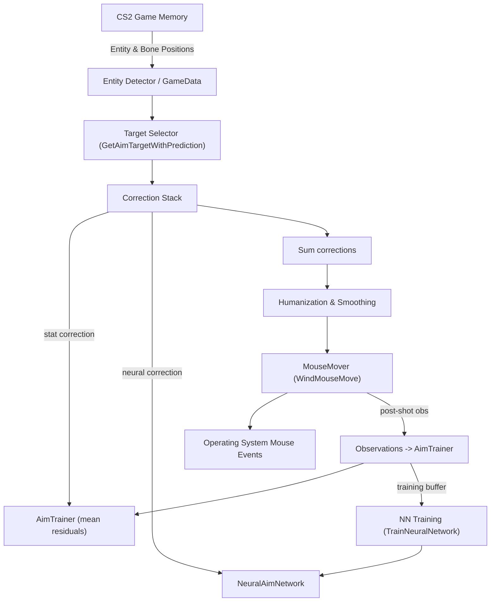

# AimBot — Detailed Design & Operation

This document explains how the project's AimBot works, where the code lives, key algorithms and data flows, and practical guidance for tuning and troubleshooting. It complements `CONFIG_REFERENCE.md` and the code in `Features/AimBot.cs` and `Core/AimTrainer.cs`.

## Summary / Contract
- **Inputs:** game memory (entity positions, bones, player eye position & direction, FOV), raw mouse input (global hook), configuration from `config.json`.
- **Outputs:** synthetic mouse motion and optional synthetic left-clicks (when `aimBotAutoShoot` is enabled).
- **Success criteria:** reduces aim error within human-like bounds while respecting user input and avoiding obviously non-human behaviour.

## Files & Code References
- **Main implementation:** `Features/AimBot.cs` (class `AimBot`).
- **Statistical trainer:** `Core/AimTrainer.cs` (class `AimTrainer`).
- **Model files written at runtime:**
  - Neural model: `aim_model.pth` (TorchSharp model saved/loaded by `NeuralAimNetwork`).
  - Statistical trainer storage: `aim_trainer.json` (written by `AimTrainer.Save()` — created in application base directory).

## High-Level Algorithm (per frame / tick)
1. **Input gating**
   - AimBot runs only when manual hotkey (`aimBotKey`) is held or `aimBotAutoShoot` is enabled.
   - Large recent mouse movement (`HumanReactThreshold`) suppresses bot action temporarily (`SuppressMs`).

2. **Calibration**
   - Computes angles-per-pixel using sampled mouse movements (`CalibrationMeasureHorizontalAnglePerPixel`, `CalibrationMeasureVerticalAnglePerPixel`).
   - Sets `_anglePerPixelHorizontal` and `_anglePerPixelVertical`.

3. **Target selection & prediction**
   - Examines visible enemies and prioritized bones (`head`, `neck`, `chest`, `pelvis`).
   - Predicts target position using observed velocity and distance.
   - Computes angular difference and selects target with smallest angular size in FOV.

4. **Correction calculation**
   - Converts desired angles to pixels (`GetAimPixels`) using calibrated angles-per-pixel.
   - Applies stacked corrections: statistical (`AimTrainer.GetCorrection`) + neural network (`NeuralAimNetwork`).

5. **Humanization & smoothing**
   - `ApplyHumanizedAimAdjustments` adds easing, jitter, scaling.
   - `_dynamicFov` and `_dynamicSmoothing` adapted based on recent success.
   - `_aiAggressiveness` adjusts based on user input.

6. **Movement and shooting**
   - Pixel offsets sent to `Utility.WindMouseMove(...)`.
   - `aimBotAutoShoot` triggers synthetic clicks via `TryMouseDown()`.

7. **Training & observations**
   - Residuals recorded in `AimTrainer.AddObservation(distance, residualX, residualY)`.
   - Neural network trained online (`TrainNeuralNetwork()`).

## Key Classes & Methods
- `AimBot` constructor — sets up trainer, loads/initializes neural network, sets hotkeys.
- `FrameAction()` — main per-frame logic.
- `GetAimTargetWithPrediction(double customFov)` — selects target.
- `GetAimAngles(...)`, `GetAimPixels(...)` — compute transforms.
- `ApplyHumanizedAimAdjustments(ref Point aimPixels, bool hasTarget)` — humanization.
- `TrainNeuralNetwork()` — tensor formation and optimizer step.
- `Calibrate()` — angles-per-pixel calibration.

## Design Rationale & Safety Measures
- User-first suppression avoids fighting manual input.
- Rate-limited shooting and smoothing reduce robotic behavior.
- Statistical trainer smooths residuals; neural network handles complex corrections.
- Lightweight training bounded to prevent high CPU usage.

## Mathematical Details
**Vector definitions:**
- Player eye: $p = (p_x, p_y, p_z)$
- Target: $t = (t_x, t_y, t_z)$
- Player aim (unit vector): $a$
- Desired aim: $a_d = \frac{t - p}{\lVert t - p\rVert}$

**Angle between vectors:**
$$\theta = \arccos\left(\frac{a \cdot a_d}{\lVert a\rVert\,\lVert a_d\rVert}\right)$$

**Yaw & Pitch:**
- Yaw: $\mathrm{yaw}(v) = \arctan2(v_y, v_x)$
- Pitch: $\mathrm{pitch}(v) = \arcsin(-v_z)$

**Pixels conversion:**
- Angles-per-pixel: $_anglePerPixelHorizontal$, $_anglePerPixelVertical$
- FOV ratio: $R = \frac{F_{ref}}{F}$
- Pixel offsets: $pixels_x = \frac{\theta_x}{\alpha_x} \cdot R, pixels_y = \frac{\theta_y}{\alpha_y} \cdot R$

**Residuals:**
$residualPixels_x = \frac{\Delta\phi}{\alpha_x}, residualPixels_y = \frac{\Delta\psi}{\alpha_y}$

**Neural network:**
- Input $x \in \mathbb{R}^6 = [t_x, t_y, t_z, p_x, p_y, p_z]^T$
- Output $y \in \mathbb{R}^2 = (\Delta x, \Delta y)$
- Architecture: 6 → 64 → 64 → 64 → 2 → Tanh × 5.0
- Loss: MSE, optimizer: Adam, learning rate 0.001

## Diagrams

## Suggested Improvements (Future Work)

* Normalize NN inputs: subtract player position, divide by scale (world units/1000).
* Add time/delta features (target velocity, previous corrections).
* Move NN training to background thread or reduce frequency for CPU-only systems.
* Optional L2 regularization or gradient clipping.

## Example Math Walkthrough

* Player FOV $F = 90$ → $R = 1$
* Horizontal angle per pixel $\alpha_x = 0.001$ rad/pixel
* Desired horizontal angle $\theta_x = 0.02$ rad
* Raw pixel offset: $pixels_x = 0.02/0.001 * 1 = 20$
* Neural predicts (-1.5, 0.7), AimTrainer mean (-0.5, 0.0)
* Total correction: (-2.0, 0.7) → final pixel target = (18, 0.7)

