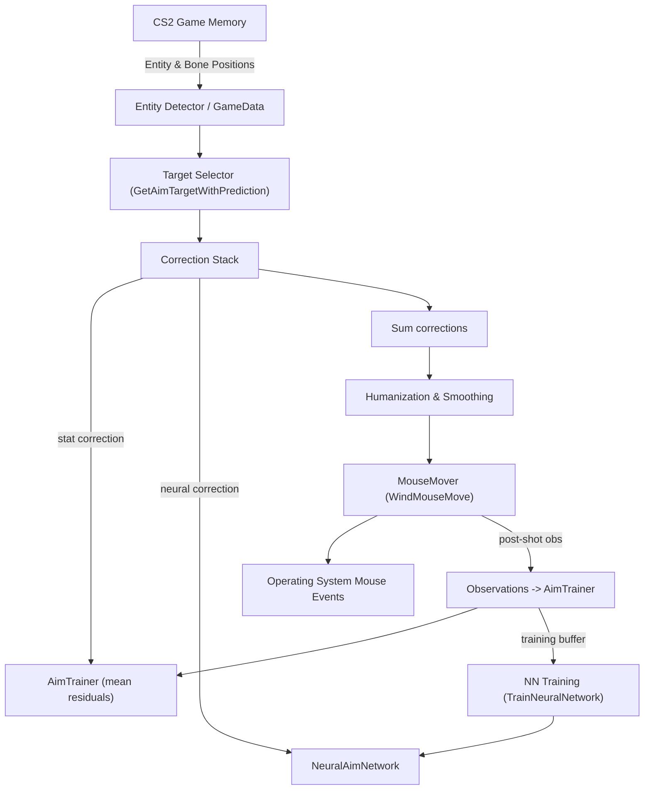

# AimBot — Detailed Design & Operation

This document explains how the project's AimBot works, where the code lives, key algorithms and data flows, and practical guidance for tuning and troubleshooting. It is written to complement `CONFIG_REFERENCE.md` and the code in `Features/AimBot.cs` and `Core/AimTrainer.cs`.

Summary / Contract
- Inputs: game memory (entity positions, bones, player eye position & direction, FOV), raw mouse input (global hook), configuration from `config.json`.
- Outputs: synthetic mouse motion and optional synthetic left-clicks (when `aimBotAutoShoot` is enabled).
- Success criteria: reduces aim error within human-like bounds while respecting user input and avoiding obviously non-human behaviour.

Files & code references
- Main implementation: `Features/AimBot.cs` (class `AimBot`).
- Statistical trainer (residual correction): `Core/AimTrainer.cs` (class `AimTrainer`).
- Model files written at runtime:
  - Neural model: `aim_model.pth` (TorchSharp model saved/loaded by `NeuralAimNetwork`).
  - Statistical trainer storage: `aim_trainer.json` (written by `AimTrainer.Save()` — created in application base directory).

High-level algorithm (per frame / tick)
1. Input gating
   - The AimBot runs only when either the manual hotkey (`aimBotKey`) is held or `aimBotAutoShoot` is enabled.
   - If recent raw mouse movement is large (above `HumanReactThreshold`) the bot suppresses action for a short window (`SuppressMs`) to prioritize the user's manual input.

2. Calibration (on first run or when required)
   - The bot calibrates angles-per-pixel using sampled mouse moves and observing the game's resulting aim direction changes (`CalibrationMeasureHorizontalAnglePerPixel`, `CalibrationMeasureVerticalAnglePerPixel`).
   - Calibration sets `_anglePerPixelHorizontal` and `_anglePerPixelVertical`, used to convert angular corrections into pixel mouse movements.

3. Target selection & prediction
   - For each visible enemy entity the bot examines prioritized bones (`head`, `neck`, `chest`, `pelvis`).
   - For each bone the code computes a small dynamic prediction using the target's observed velocity and a prediction time that scales with distance.
   - The bot computes the angular difference between the player's current aim direction and the predicted bone position (`GetAimAngles`) and selects the target with the smallest angular size inside the configured FOV.

4. Correction calculation
   - Converts desired angular move to pixel offset (`GetAimPixels`) using calibrated angles-per-pixel and player's FOV.
   - Applies two stacked corrections:
     - Statistical correction from `AimTrainer.GetCorrection(distance)` (bucketed by distance). This is a rolling average of historical residuals collected after shots.
     - Neural network correction from `NeuralAimNetwork` (TorchSharp). The network takes 6 floats (targetPos xyz + playerPos xyz) and outputs 2 floats (pixel corrections). The network is small (3 hidden layers of 64 units) and outputs are scaled via tanh * 5.0.
   - These corrections are summed and applied to the pixel offsets.

5. Humanization & smoothing
   - Apply `ApplyHumanizedAimAdjustments` which scales and eases corrections based on distance, lock duration and small random jitter to simulate human micro-adjustments.
   - Smoothing and dynamic FOV (`_dynamicFov`, `_dynamicSmoothing`) are adapted over time based on recent aim success rate.
   - `_aiAggressiveness` is adapted by measuring recent user mouse movement; more user movement lowers aggressiveness.

6. Movement and shooting
   - Pixel offsets are passed to `Utility.WindMouseMove(...)` (the “new” mouse mover) for smoother, more human-like motion.
   - If `aimBotAutoShoot` is enabled, the bot will try to issue synthetic mouse down events using `TryMouseDown()` with rate limiting (`MinShootIntervalMs`). If manual mode is used (hotkey), real player input controls firing.

7. Training & observations
   - After a shot, the bot waits a short interval and compares the player's aim direction before/after to compute residual pixel error. It records that residual into `AimTrainer.AddObservation(distance, residualX, residualY)`.
   - `AimTrainer` buckets residuals by distance (100-unit buckets) and maintains sums/counts per bucket. Periodically it saves to `aim_trainer.json`.
   - The neural network is trained online from a rolling buffer of recent aim samples (`_trainingData`) in `TrainNeuralNetwork()` using a simple MSE loss and Adam optimizer. Training runs in-process and is intentionally light-weight (small batch from last ~100 samples).

Key classes & methods (quick map)
- `AimBot` (constructor) — sets up trainer, loads or initializes neural network, sets hotkeys.
- `FrameAction()` — main per-frame logic: gating, calibration, selecting target, computing corrections, applying humanization, moving mouse, shooting, and collecting training observations.
- `GetAimTargetWithPrediction(double customFov)` — selects best target and applies dynamic prediction from last observed velocity.
- `GetAimAngles(...)`, `GetAimPixels(...)` — compute necessary angular and pixel transforms.
- `ApplyHumanizedAimAdjustments(ref Point aimPixels, bool hasTarget)` — ease, jitter, scaling logic.
- `TrainNeuralNetwork()` — forms tensors from recent samples, runs forward/backward and optimizer step.
- `Calibrate()` and `CalibrationMeasure*` — compute angles-per-pixel by issuing controlled mouse moves and observing game direction changes.

Design rationale & safety measures
- User-first suppression: the bot monitors raw mouse deltas via a low-level hook and pauses if the user moves more than `HumanReactThreshold` to avoid fighting the player's own input.
- Rate-limited shooting and conservative default smoothing reduce the risk of obviously robotic behavior.
- The statistical trainer smooths out consistent residual biases (e.g., due to sensitivity mismatches) while the neural network captures more complex corrections.
- Training is lightweight and bounded (max stored samples) to avoid runaway CPU usage.

Practical tuning knobs (where to change)
- `HumanReactThreshold` (AimBot.cs) — increase to be less sensitive to user movement.
- `SuppressMs` — suspension window after large user input.
- `_dynamicFov` and `_dynamicSmoothing` — adjusted automatically by success rate; initial values and clamps are in `AimBot.cs`.
- `AimTrainer` bucket size and `MaxBucketCount` — see `Core/AimTrainer.cs`.
- Neural network hyperparameters: hidden size, learning rate (in `InitNeuralNetwork()` / `TrainNeuralNetwork()`), training batch/window sizes.

Files to manage / troubleshooting
- `aim_model.pth` — delete to reset the neural model. Location: application base directory (where the executable runs).
- `aim_trainer.json` — delete to reset statistical corrections.
- Logs: AimBot prints training errors and important events to console.

Edge cases & limitations
- External reading only: If DTOs/offsets are stale, the bot may read incorrect memory and fail. Keep DTOs updated from `CS2-OFFSETS`.
- Performance: On CPU-only TorchSharp builds training/inference is slower. Consider disabling neural training or switching to the CUDA package.
- Safety & ethics: Use for research only; authors do not encourage use in live multiplayer games.

References
- Code: `Features/AimBot.cs`, `Core/AimTrainer.cs`.
- Neural weights file: `aim_model.pth` (saved/loaded by `NeuralAimNetwork`).

If you want, I can also generate an architectural diagram (SVG/PNG) that shows data flow (Game → Detector → Trainer/Network → Mouse mover) and annotate code locations. Ask and I'll add it to the docs.

## Mathematical details

This section states the math used by the code and how angles, pixels and residuals are computed.

Vector definitions

- Player eye position: $p = (p_x, p_y, p_z)$
- Target world position: $t = (t_x, t_y, t_z)$
- Player aim direction (unit vector): $a$ (from game memory)
- Desired aim direction (unit vector):
   $$a_d = \frac{t - p}{\lVert t - p\rVert}$$

Angle between vectors

The angle between the current aim and desired aim is:
$$\theta = \arccos\left(\frac{a \cdot a_d}{\lVert a\rVert\,\lVert a_d\rVert}\right)$$
In code we use signed horizontal and vertical components computed via projection helpers; the horizontal component is effectively a signed yaw difference and the vertical a signed pitch difference.

Yaw and pitch (used in code)

- Yaw (horizontal angle) is computed as:
   $$\mathrm{yaw}(v) = \arctan2(v_y, v_x)$$
- Pitch (vertical angle) is approximated as:
   $$\mathrm{pitch}(v) = \arcsin(-v_z)$$

These correspond to the `GetYaw` and `GetPitch` helpers in the code.

Converting angular correction to pixels

Let $\alpha_x$ and $\alpha_y$ be the measured angles-per-pixel for horizontal and vertical (`_anglePerPixelHorizontal`, `_anglePerPixelVertical`).
Let $F_{\mathrm{ref}}=90$ be the reference FOV used by the code when computing the FOV ratio and $F$ be the player's current FOV (in degrees).

The code computes a FOV ratio:
$$R = \frac{F_{\mathrm{ref}}}{F}$$

Then pixel offsets are computed as:
$$\text{pixels}_x = \frac{\theta_x}{\alpha_x} \cdot R,\qquad \text{pixels}_y = \frac{\theta_y}{\alpha_y} \cdot R$$

Residuals (what AimTrainer sees)

After a shot, the code measures the change in yaw/pitch and computes residual pixel errors. Given the observed change in yaw $\Delta\phi$ and pitch $\Delta\psi$ (radians):
$$\text{residualPixels}_x = \frac{\Delta\phi}{\alpha_x},\qquad \text{residualPixels}_y = \frac{\Delta\psi}{\alpha_y}$$

AimTrainer statistics

AimTrainer buckets by distance (bucket key $k = \mathrm{round}(\mathrm{distance}/100)$). For a bucket we maintain:
- count $n_k$
- sum of residuals $S_{x,k}, S_{y,k}$

The mean correction applied for bucket $k$ is:
$$\mu_{x,k} = \frac{S_{x,k}}{n_k},\qquad \mu_{y,k} = \frac{S_{y,k}}{n_k}$$

These means are retrieved via `GetCorrection(distance)` and added to the neural correction.

Neural network formulation

The network maps inputs to pixel corrections:

- Input vector $x \in \mathbb{R}^6$ (concatenation of target position and player eye position):
   $$x = [t_x, t_y, t_z,\; p_x, p_y, p_z]^T$$
- Network outputs $y \in \mathbb{R}^2$ representing pixel corrections $(\Delta x, \Delta y)$.

Architecture implemented in `NeuralAimNetwork`:

Input (6) → Linear(6→64) → ReLU → Linear(64→64) → ReLU → Linear(64→64) → ReLU → Linear(64→2) → Tanh × 5.0

Loss and training

The training loss is Mean Squared Error (MSE) between predicted corrections and observed angle-derived targets (converted to pixels). If $\hat{y}$ is the prediction and $y$ is the target, then:
$$\mathcal{L} = \frac{1}{m}\sum_{i=1}^m \lVert\hat{y}^{(i)} - y^{(i)}\rVert_2^2$$

Optimizer: Adam with learning rate $\eta=0.001$.

Notes on normalization

The current implementation feeds raw positions (world coordinates) into the network. This can work but is sensitive to absolute coordinate scales. Normalizing inputs (e.g., subtracting player position and dividing by a scale like 1000) often improves stability and will be a suggested enhancement in the next section.

## Diagrams

Mermaid architecture diagram (GitHub supports this if enabled):

If mermaid is not available in a viewer, here is a compact ASCII flow:

GameMemory -> Detector -> Selector -> [AimTrainer + NeuralNet] -> Combiner -> Humanize -> MouseMover -> OS

Network architecture (visual)

Input(6) -> [Linear64] -> ReLU -> [Linear64] -> ReLU -> [Linear64] -> ReLU -> [Linear2] -> Tanh * 5

## Suggested improvements (future work)

- Normalize neural network inputs: subtract player position and divide by a scale (e.g., world units per 1000). This reduces variance and improves training stability.
- Add time/delta features to the network (target velocity or previous corrections) for better dynamic prediction.
- Move NN training to a background worker thread or reduce training frequency to bound CPU usage on CPU-only systems.
- Add optional L2 regularization or gradient clipping to avoid large weight updates.

## Example math walkthrough (small numeric example)

Assume:
- player FOV $F=90$ (so $R=1$)
- horizontal angle per pixel $\alpha_x = 0.001$ radians/pixel
- desired horizontal angle difference $\theta_x = 0.02$ radians

Then raw pixel offset:
$$\text{pixels}_x = \frac{0.02}{0.001}\cdot 1 = 20\ \text{pixels}$$

If neural predicts $(-1.5, 0.7)$ and AimTrainer bucket mean is $(-0.5, 0.0)$, total correction = $(-2.0, 0.7)$, so final pixel target becomes $(18, 0.7)$ (rounded to integers in code).

---